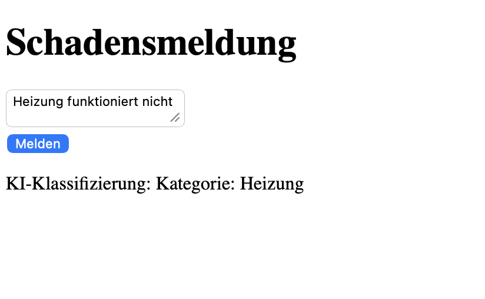
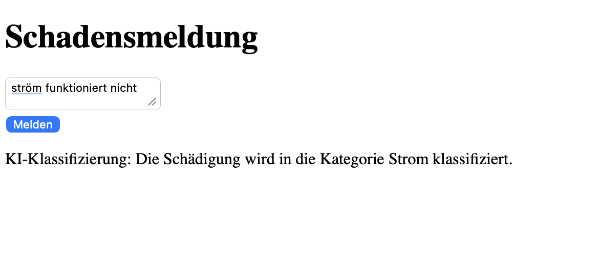

# Schadensmelder

Ein KI-gestütztes Tool zur Meldung und Klassifizierung von Schäden (z. B. Heizung, Wasser, Strom oder Sonstiges) mithilfe von **Ollama**.  
Benutzer können Schäden über ein einfaches Web-Interface melden, und die KI kategorisiert sie automatisch.

---

## 🚀 Features
- Schadenmeldung über Webformular
- KI-gestützte Klassifizierung der Meldungen via **Ollama Mistral**
- Automatisierte Verarbeitung von Meldungen
- Anzeige der Klassifizierung direkt im Browser
- Einfacher Aufbau: Node.js Backend + HTML/JS Frontend

---

## 🧰 Tech Stack
- **Backend**: Node.js, Express, Axios, CORS
- **Frontend**: HTML, CSS, JavaScript
- **KI**: Ollama (lokales Mistral-Modell)
- **Abhängigkeiten**: Siehe `package.json`

---


---

## ▶️ Installation & Setup

### 1. Repository klonen
```bash
git clone https://github.com/otmanedd/schadensmelder.git
cd schadensmelder
```
### 2. Backend einrichten
```
cd backend
npm install
```
## 3. Ollama einrichten
Ollama installieren (macOS Beispiel):
```
brew install ollama

```
Modell laden:
```
ollama pull mistral
```

## 4. Backend starten
```
npm start
```
Das Backend läuft dann auf: http://localhost:3000

## 5. Frontend starten
- Einfach frontend/index.html im Browser öffnen
- Formular ausfüllen und Schaden melden
## 🧪 Nutzung
1. Öffne frontend/index.html im Browser
2 Beschreibe den Schaden im Textfeld
3. Klicke auf Melden
4. Das Backend fragt Ollama ab und gibt die Klassifizierung zurück
## 📸 Screenshot beispiel
So sieht das Frontend aus, wenn ein Schaden gemeldet wird:





### ⚙️ Automatisierungsprozess
Der Schadensmelder verarbeitet Meldungen vollständig automatisch. Der Ablauf ist einfach:
- Der Benutzer füllt das Formular im Frontend aus.
- Das Frontend sendet die Meldung an das Backend (/report).
- Das Backend empfängt die Meldung und ruft Ollama Mistral auf.
- Ollama klassifiziert den Schaden automatisch (z. B. Heizung, Wasser, Strom, Sonstiges).
- Das Backend schickt die Klassifizierung zurück an das Frontend.
- Das Frontend zeigt das Ergebnis direkt dem Benutzer an.
- Keine manuellen Schritte notwendig zwischen Meldung und Klassifizierung
- Automatisierte Pipeline spart Zeit und Fehler bei der Klassifizierung

### ✅ Roadmap / Mögliche Features
- Upload von Fotos für Schäden
- Speicherung der Meldungen in Datenbank
- Erweiterte KI-Analyse für genauere Klassifizierung
- Dashboard mit Statistiken
- Authentifizierung / Benutzerverwaltung
